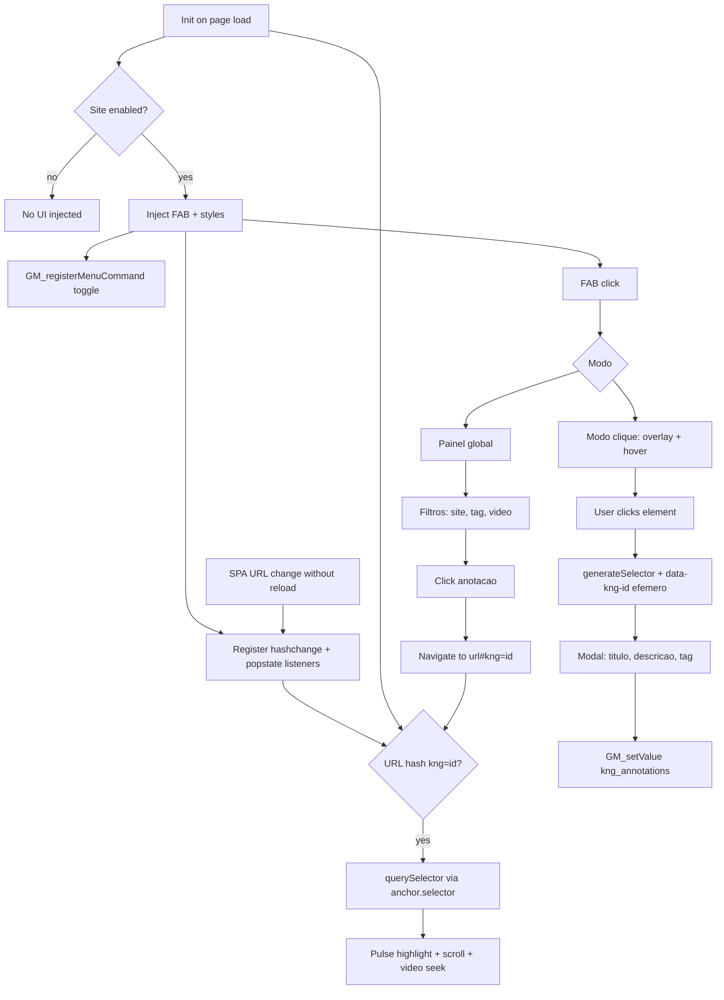

# Plano: Userscript KNotaçõesG para Tampermonkey

## Contexto

O workspace [`/home/caio/Área de trabalho/Extensao KNotaçõesG`](/home/caio/Área de trabalho/Extensao KNotaçõesG) está vazio. Será criado **um único arquivo** autocontido, pronto para instalar no Tampermonkey.

## Arquivo a criar

- [`knotacoes.user.js`](/home/caio/Área de trabalho/Extensao KNotaçõesG/knotacoes.user.js) — userscript completo (~400–550 linhas)

## Cabeçalho de metadados (obrigatório)

```javascript
// ==UserScript==
// @name         KNotaçõesG
// @namespace    https://github.com/meu-usuario/knotacoesg
// @version      1.0.0
// @description  Anotações globais em qualquer site
// @author       meu-usuario
// @match        *://*/*
// @grant        GM_setValue
// @grant        GM_getValue
// @grant        GM_registerMenuCommand
// @updateURL    https://raw.githubusercontent.com/meu-usuario/repo/main/knotacoes.user.js
// @downloadURL  https://raw.githubusercontent.com/meu-usuario/repo/main/knotacoes.user.js
// ==/UserScript==
```

## Modelo de dados (GM_setValue)

Duas chaves globais:

| Chave | Tipo | Conteúdo |
|---|---|---|
| `kng_annotations` | `Array<Annotation>` | Todas as anotações |
| `kng_site_enabled` | `Record<hostname, boolean>` | Toggle por site (default: `true`) |

Estrutura de cada anotação:

```javascript
{
  id: "uuid-v4",
  title: string,
  description: string,
  tag: string | null,
  url: string,           // location.href no momento da criação
  hostname: string,      // para filtro por site
  createdAt: number,     // Date.now()
  videoTimestamp: number | null,  // segundos, se houver <video> ativo
  anchor: {
    selector: string,    // CSS selector robusto — método PRINCIPAL de reencontro após reload
    markerId: string     // data-kng-id efêmero — só durante a sessão de criação (não persiste no DOM)
  }
}
```

**Persistência:** `loadAnnotations()` / `saveAnnotations()` encapsulam `GM_getValue` / `GM_setValue`. Nenhum dado é apagado ao desativar o script no site.

## Arquitetura



## Funcionalidades detalhadas

### 1. Toggle por site (GM_registerMenuCommand)

- Comando: **"Ativar/Desativar Anotações neste site"**
- Lê `kng_site_enabled[location.hostname]` (default `true`)
- Ao desativar: remove FAB, painel e overlay do DOM; **não** apaga `kng_annotations`
- Ao ativar: reinjeta UI imediatamente
- Label dinâmico: `"Desativar..."` ou `"Ativar..."` conforme estado atual

### 2. Interface principal (quando ativado)

Estilo escolhido: **botão flutuante (FAB) + modais** — mínimo impacto visual.

- **FAB** fixo (canto inferior direito, `z-index: 2147483646`)
- Dois modos via menu do FAB:
  - **Nova anotação (clique):** overlay semi-transparente; cursor crosshair; hover destaca elemento (`outline`); clique abre modal de formulário
  - **Ver anotações:** abre painel global

**Modal de criação:**
- Campos: Título (obrigatório), Descrição, Tag (opcional)
- Se existir `<video>` **nativo no mesmo origin** (prioridade: vídeo em foco/play ou primeiro `<video>` visível), captura `video.currentTime` e exibe preview `"Timestamp: MM:SS"`
- Ao clicar no elemento: chama `generateSelector(el)` e injeta `data-kng-id` **apenas na sessão atual** (evita cliques duplicados acidentais antes de salvar; **não** é persistido no DOM entre reloads)

### 2.1. `generateSelector` — método principal de reencontro

O seletor CSS salvo em `anchor.selector` é a **fonte de verdade** para localizar o elemento após reload ou navegação. O `data-kng-id` **não** sobrevive a recarregamentos — sites estáticos e SPAs removem atributos injetados localmente.

Estratégia de geração (em ordem de preferência):

1. **`#id`** se o elemento ou ancestral próximo tiver `id` único e estável
2. **`[data-*]`** de atributos nativos da página (não o `data-kng-id` do script)
3. **Classes únicas** — combinar tag + classes que identifiquem unicamente o nó no contexto local
4. **Caminho com `:nth-of-type()` / `:nth-child()`** — subir a árvore DOM construindo segmentos até `document.body`, validando unicidade com `document.querySelectorAll(sel).length === 1`
5. **Fallback** — caminho completo mesmo que longo, desde que resolva para um único elemento

Função auxiliar `validateSelector(sel)` confirma que o seletor retorna exatamente o elemento original antes de salvar a anotação.

### 3. Painel de visualização global

Modal/painel lateral com:
- **Lista** de todas as anotações (ordenadas por `createdAt` desc)
- **Filtros:**
  - Site: dropdown com hostnames únicos
  - Tag: dropdown com tags existentes + "Sem tag"
  - Timestamp de vídeo: checkbox "Somente com timestamp de vídeo"
- Cada item mostra: título, hostname, tag, data, timestamp de vídeo (se houver)
- **Ação ao clicar:** `window.location.href = annotation.url + '#kng=' + annotation.id`

### 4. Destaque visual após navegação

Função central: `tryHighlightFromHash()` — dispara sempre que a URL relevante mudar, não só no `Init`.

**Gatilhos (SPA-safe):**
- Execução imediata no `Init` (primeiro carregamento)
- `window.addEventListener('hashchange', tryHighlightFromHash)`
- `window.addEventListener('popstate', tryHighlightFromHash)`
- Interceptação de `history.pushState` / `history.replaceState` (wrapper que chama `tryHighlightFromHash` após cada mutação) — cobre YouTube e SPAs que mudam URL sem reload

**Resolução do elemento** (se `location.hash` = `#kng={id}`):

1. **Principal:** `document.querySelector(anchor.selector)` — único método confiável após reload
2. **Sessão atual apenas:** se `[data-kng-id="{id}"]` existir no DOM (usuário acabou de criar, sem reload), pode ser usado como atalho
3. Se elemento não encontrado: exibir toast discreto `"Elemento não encontrado — a página pode ter mudado"` e abortar destaque
4. Se vídeo `<video>` nativo no mesmo origin e `videoTimestamp` presente: define `video.currentTime` e tenta `play()` (silencioso se autoplay bloqueado)
5. Scroll suave até o elemento (`scrollIntoView`)
6. Animação de destaque: pulso com `@keyframes kng-pulse` (outline amarelo/dourado, 3 ciclos, ~3s)

**Retry para SPAs lentas:** se o hash bater mas o DOM ainda não tiver renderizado o alvo, usar `setTimeout` com backoff curto (ex.: 3 tentativas em 500ms / 1s / 2s) antes de desistir.

### 5. Estilos e isolamento

- Todo CSS injetado com prefixo `.kng-*` e `!important` onde necessário para resistir a estilos host
- Shadow DOM **não** será usado (complexidade desnecessária para userscript); prefixo de classes + z-index alto é suficiente
- Event listeners com `stopPropagation` nos modais para não interferir na página

## Estrutura interna do código

```
knotacoes.user.js
├── METADATA block
├── STORAGE (load/save annotations, site toggle)
├── SELECTOR UTILS (generateSelector, validateSelector, injectEphemeralMarker)
├── VIDEO UTILS (findNativeVideo, formatTimestamp)
├── UI BUILDERS (createFAB, createModal, createPanel, createOverlay)
├── ANNOTATION MODE (enterClickMode, exitClickMode, handleElementClick)
├── HIGHLIGHT (tryHighlightFromHash, highlightElement, retryWithBackoff)
├── URL WATCHERS (hashchange, popstate, history.pushState/replaceState wrapper)
├── MENU (registerToggleCommand)
└── INIT (bootstrap)
```

## Fluxo do usuário

1. Instalar script no Tampermonkey
2. Em qualquer site, FAB aparece (se site ativo)
3. Clicar FAB → "Nova anotação" → clicar em elemento → preencher formulário → salvar
4. Clicar FAB → "Ver anotações" → filtrar → clicar item → redireciona e destaca local
5. Menu Tampermonkey → desativar no site atual → FAB some; dados permanecem

## Limitações conhecidas (documentar no código)

- **`data-kng-id` não persiste entre reloads** — atributo injetado localmente desaparece ao recarregar; reencontro depende exclusivamente de `anchor.selector`
- **Seletores CSS podem quebrar** se a estrutura DOM mudar drasticamente (redesign, A/B tests, conteúdo dinâmico); `generateSelector` mitiga, mas não garante 100%
- **Timestamp de vídeo em iframes (CORS):** captura de `currentTime` só funciona em elementos `<video>` nativos no **mesmo origin** da página. Vídeos embutidos via `<iframe>` (ex.: player do YouTube em blog externo) são inacessíveis por Same-Origin Policy — timestamp só será capturado quando a anotação for feita diretamente no domínio que hospeda o player (ex.: youtube.com)
- **SPAs:** mesmo com listeners de URL, o destaque pode falhar se o seletor apontar para nós removidos/recriados pelo framework antes do retry esgotar
- `@match *://*/*` roda em todos os sites; sites com CSP restritiva raramente bloqueiam userscripts Tampermonkey

## Verificação manual pós-implementação

1. Instalar `knotacoes.user.js` no Tampermonkey e confirmar grants no cabeçalho
2. Abrir site qualquer → FAB visível → criar anotação via clique em elemento
3. Abrir painel → filtrar por site/tag → clicar anotação → confirmar redirect + destaque
4. Testar em página com `<video>` nativo → confirmar captura de timestamp; em blog com iframe do YouTube → confirmar que timestamp **não** é capturado (comportamento esperado)
5. Testar no YouTube (SPA): criar anotação → navegar via painel → confirmar destaque **sem** reload completo (hashchange / pushState)
6. Recarregar página com hash `#kng=id` → confirmar reencontro via **CSS selector**, não via `data-kng-id`
7. Menu Tampermonkey → desativar → FAB some → recarregar → ainda desativado → reativar → FAB volta; anotações intactas
